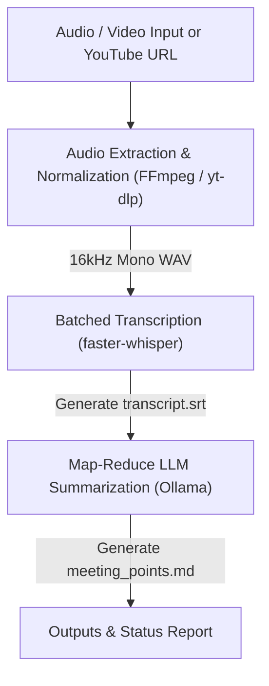

# Local Meeting Pipeline

A high-performance, privacy-focused Python pipeline that processes audio or video files (and YouTube URLs), transcribes them using `faster-whisper`, and generates structured meeting summary bullet points using local LLMs via Ollama.

---

## 🏗️ Pipeline Architecture



1. **Audio Extraction**: Converts input files (`.mp3`, `.mp4`, `.wav`, `.mkv`) or YouTube URLs into normalized PCM 16-bit, 16kHz mono `.wav` audio via `ffmpeg` / `yt-dlp`.
2. **Batched Transcription**: Transcribes audio in parallel batches using `faster-whisper` (`BatchedInferencePipeline`) and outputs a timestamped `.srt` subtitle file.
3. **Structured Summarization**: Feeds the transcript to a local **Ollama** model (`LiquidAI/lfm2.5-1.2b-instruct` or custom) to produce structured Portuguese meeting points (*Pontos principais*, *Decisões*, *Ações*, *Pendências*). Long transcripts are automatically split and consolidated using Map-Reduce.

---

## 🐳 Docker Execution

The pipeline is fully containerized with isolated Ollama integration. You can select between **CPU Mode** and **GPU Mode** (CUDA accelerated) via `.env`.

### 1. Configuration (`.env`)

Copy the environment template:

```bash
cp .env.example .env
```

Select your execution mode in `.env`:

* **CPU Mode (Default)**:

  ```env
  COMPOSE_FILE=docker-compose.yaml
  ```

* **GPU Mode (CUDA Acceleration)**:

  ```env
  COMPOSE_FILE=docker-compose.yaml:docker-compose.gpu.yaml
  ```

### 2. Build the Container Image

```bash
docker compose build app
```

### 3. Run the Pipeline

Running `docker compose run` automatically starts the Ollama service and triggers `ollama-pull-model` to pull the default LLM model (`LiquidAI/lfm2.5-1.2b-instruct`) before executing the pipeline:

```bash
docker compose run --rm app --target sample.mp3
```

> 💡 **Automatic Model Pulling**:
> The `app` service depends on `ollama-pull-model` (`condition: service_completed_successfully`), ensuring Ollama is running and the model is downloaded into the shared volume before pipeline execution starts.

---

## 💻 Local CLI Execution

### Prerequisites

* **Python >= 3.14**
* **[uv](https://docs.astral.sh/uv/)** package manager
* **FFmpeg** (`apt install ffmpeg` or `brew install ffmpeg`)
* **[Ollama](https://ollama.com/)** running locally: `ollama pull LiquidAI/lfm2.5-1.2b-instruct`

### Installation & Usage

```bash
# Install dependencies
uv sync

# Run pipeline
uv run meeting-pipeline --target <path_or_youtube_url> [OPTIONS]
```

### Configuration Profiles & Presets

| Shortcut | Preset (`-p`) | Whisper Model | Device | Compute Type | Default LLM |
| :--- | :--- | :--- | :--- | :--- | :--- |
| *(Default)* | `cpu` | `medium` | `cpu` | `int8` | `LiquidAI/lfm2.5-1.2b-instruct` |
| `--fast` | `fast` | `small` | `cpu` | `int8` | `LiquidAI/lfm2.5-1.2b-instruct` |
| `--gpu` | `gpu` / `cuda` | `medium` | `cuda` | `float16` | `llama3.1:8b` |
| — | `accurate` | `large-v3` | `cuda` | `float16` | `llama3.1:8b` |

> 💡 *GPU presets (`gpu`, `cuda`, `accurate`) and `--gpu` flags are automatically validated and disabled when running in CPU mode.*

### Options

| Option | Type | Default | Description |
| :--- | :--- | :--- | :--- |
| `--target` | `str` | *Required* | Local file path or YouTube video URL |
| `--preset`, `-p` | `str` | `cpu` | Configuration profile (`cpu`, `fast`, `gpu`, `cuda`, `accurate`) |
| `--gpu` | `flag` | `False` | Shortcut for `--preset gpu` |
| `--fast` | `flag` | `False` | Shortcut for `--preset fast` |
| `--whisper-batch-size` | `int` | `2` | Transcription batch size (higher values increase speed & memory usage) |
| `--whisper-model` | `str` | *(preset)* | Whisper model size (`tiny`, `small`, `medium`, `large-v3`) |
| `--whisper-device` | `str` | *(preset)* | Compute device (`cpu` or `cuda`) |
| `--whisper-compute-type` | `str` | *(preset)* | Quantization (`int8`, `float16`) |
| `--llm-model` | `str` | *(preset)* | Ollama model name |
| `--language` | `str` | `pt` | Language code for transcription |
| `--video` | `flag` | `False` | Enforce video summary prompt template (saves summary to `<stem>_resume.md`) |
| `--meeting` | `flag` | `False` | Enforce meeting summary prompt template (saves summary to `<stem>_meeting_points.md`) |
| `--verbose` | `flag` | `False` | Enable detailed step timing logs |

---

## 📁 Output Artifacts

All outputs are suffixed with the input file/video name and saved to `--output-dir` (default: `output/`):

- **`<name>_transcript.srt`**: Timestamps and subtitles in SubRip format.
- **`<name>_resume.md`**: Video summary (used when `--video` is set or processing video URLs).
- **`<name>_meeting_points.md`**: Meeting points summary (used when `--meeting` is set or processing audio/meeting files).
- **`<name>_metadata.json`**: Execution timings, models used, and audio metrics.
- **`<name>_normalized.wav`**: 16kHz mono audio extracted from input.

---

## 🛠️ Verification & Testing

```bash
# Run unit tests
uv run meeting-pipeline-test

# Type checking (Pyrefly)
uv run pyrefly check

# Code linting (Ruff)
uv run ruff check
```
